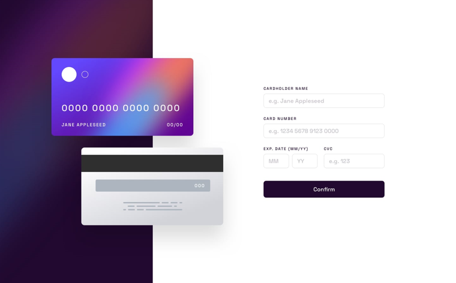
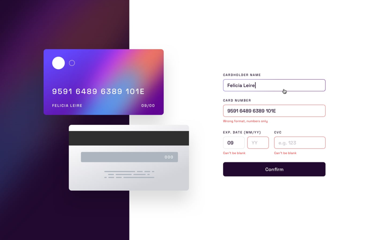
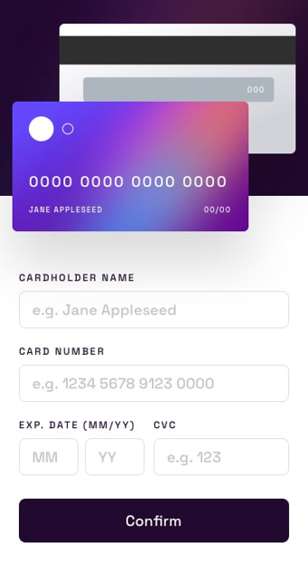
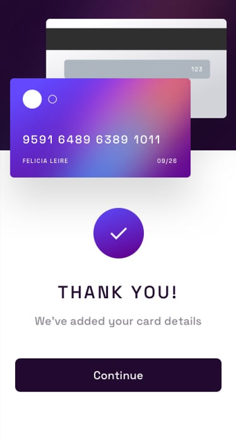

# Formulário iterativo de cartão

Esta é uma solução para o desafio [Interactive card details form](https://www.frontendmentor.io/challenges/interactive-card-details-form-XpS8cKZDWw) do Frontend Mentor.

## Índice

- [Sobre o projeto](#sobre-o-projeto)
  - [O desafio](#o-desafio)
  - [Design](#design)
    - [Desktop](#desktop)
    - [Mobile](#mobile)
  - [Tecnologias](#tecnologias)
- [Autor](#autor)

## Sobre o projeto

### O desafio

Os usuários devem ser capazes de:

- Preencher o formulário e ver os detalhes do cartão atualizarem em tempo real.
- Receber mensagens de erro quando o formulário for enviado se:
  - Qualquer campo de entrada estiver vazio.
  - Os campos de número do cartão, data de validade ou CVC estiverem em formato incorreto.
- Ver o layout ideal dependendo do tamanho da tela de seus dispositivos.
- Ver estados de hover, ativação e foco para elementos interativos na página.

### Design

Abaixo há imagens do design proposto por Frontend Mentor para o desafio.

#### Desktop

Tela inicial:

Estados de erros ativos:

Tela de agradecimento:

#### Mobile

 

### Tecnologias

#### Desenvolvido com:

- HTML
- CSS
- Flexbox
- CSS Grid
- JavaScript

## Autor

- Linkedin - [Jhony Vill da Silva](https://www.linkedin.com/in/jhony-vill-da-silva-390239210)
